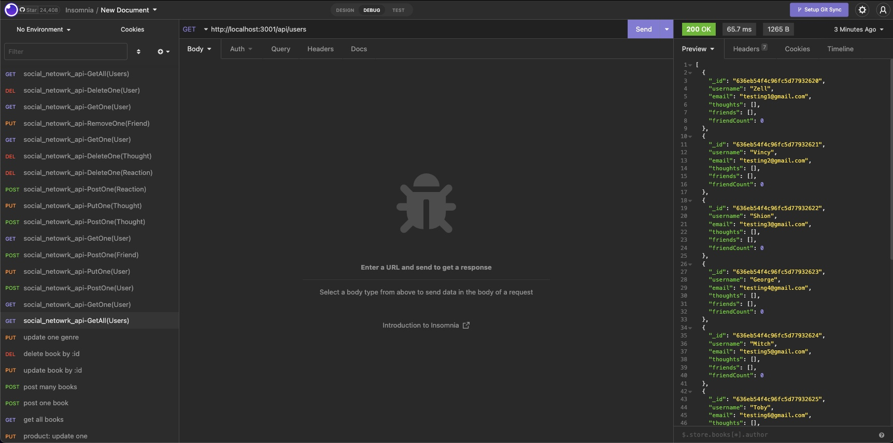

# m18c-social_network_api
# GitHub Username: PatrickARatcliff
# 
# Date: 11/11/2022, 2:13:36 pm

Repo Link:

GitHub Repo URL: https://github.com/PatrickARatcliff/m18c-social_network_api

Demo Video:

Google Drive URL: https://drive.google.com/file/d/1HJJwY1wNmWytHpgJVv-gxtMx9xWfbhsH/view

Screenshot:

## Table of Contents
- [Project Description](#project-description)
- [Installation Instructions](#installation-instructions)
- [Usage Information](#usage-information)
- [Contribution Guidelines](#contribution-guidelines)
- [Test Instructions](#test-instructions)
- [License](#license)
  
## Project Description
- Using Express.js for routing, a MongoDB database, and the Mongoose ODM, this API for a social network web application allows users to share their thoughts, react to friends thoughts, and create a friends list.
  
## Installation Instructions
- Clone the repository from GitHub, run "npm i" from the root directory in terminal. run "npm run seed" from your terminal to pupulate data in MongoDB, run "npm run dev" for development OR run "npm start" to start the server.
  
## Usage Information
- To use, simply open m18c-social_network_api directory with the integrated terminal/bash. type the command “npm start”. Using Insomnia, Postman, or another REST client you can get all users, a single user; post a new user, add a friend to an existing user, post a thought, post a reaction to an existing thought; remove a reaction from a thought, remove a thought, remove a friend from a user, and delete a user.
  
## Contribution Guidelines
- To contribute to this project, fork the repository at ‘https://github.com/PatrickARatcliff/m18c-social_network_api',create a pull request with a description for the change and its location.
  
## Test Instructions
- N/A
    
## License
- MIT License
- m18c-social_network_api: An API for a social network web application where users can share their thoughts, react to friends’ thoughts, and create a friend list..
- Copyright (c) [2022] [Patrick Ratcliff]. All rights reserved.

    

      Permission is hereby granted, free of charge, to any person obtaining a copy
      of this software and associated documentation files (the "Software"), to deal
      in the Software without restriction, including without limitation the rights
      to use, copy, modify, merge, publish, distribute, sublicense, and/or sell
      copies of the Software, and to permit persons to whom the Software is
      furnished to do so, subject to the following conditions:

      The above copyright notice and this permission notice shall be included in all
      copies or substantial portions of the Software.

      THE SOFTWARE IS PROVIDED "AS IS", WITHOUT WARRANTY OF ANY KIND, EXPRESS OR
      IMPLIED, INCLUDING BUT NOT LIMITED TO THE WARRANTIES OF MERCHANTABILITY,
      FITNESS FOR A PARTICULAR PURPOSE AND NONINFRINGEMENT. IN NO EVENT SHALL THE
      AUTHORS OR COPYRIGHT HOLDERS BE LIABLE FOR ANY CLAIM, DAMAGES OR OTHER
      LIABILITY, WHETHER IN AN ACTION OF CONTRACT, TORT OR OTHERWISE, ARISING FROM,
      OUT OF OR IN CONNECTION WITH THE SOFTWARE OR THE USE OR OTHER DEALINGS IN THE
      SOFTWARE.

    
***[This is an external link to the MIT license](https://en.wikipedia.org/wiki/MIT_License)***
  
---
